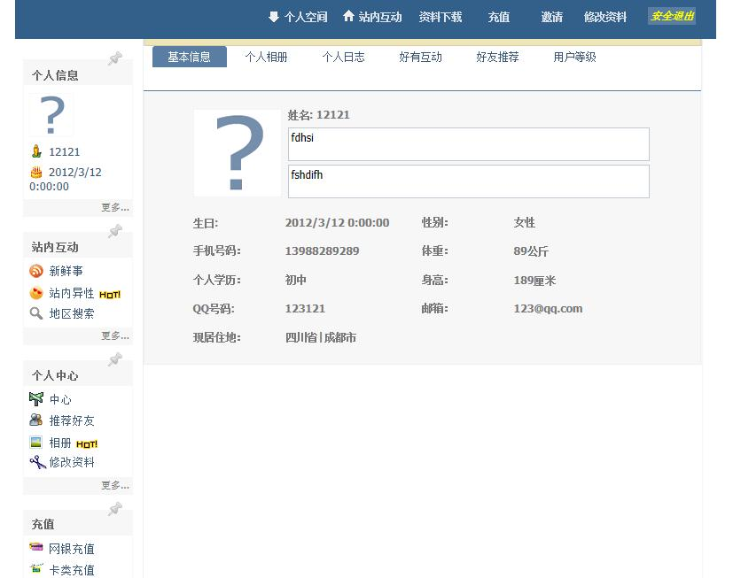

# Project Brief #

### ActiveMQ Cluster###

#### introduction ####
Apache ActiveMQ ™ is the most popular and powerful open source messaging and Integration Patterns server.see more: [http://activemq.apache.org](http://activemq.apache.org "Apache ActiveMQ")
However, there are some disadvantages when use ActiveMQ Servers as Cluster.  

1. Manage and configurate cluster difficultly when the number of the cluster increases.  
2. Need a balance when there are many message producer. 

**See More In : [https://github.com/elegantyuanjian/ActiveMQCluster/](https://github.com/elegantyuanjian/ActiveMQCluster/)**

#### key features ####
1. Manage the ActiveMQ Servers in the clusters easily using the ClusterController and ActiveMQMonitor. 
2. Balance the input streams using **consistent hashing method** when dispathch connecting URL.
3. Client API supperted language include **Java,c#,c/c++** 
4. Using [eclipse jetty](http://www.eclipse.org/jetty/ "eclipse jetty") as web server and [google protocol buffer](http://code.google.com/p/protobuf/ "google protocol buffer") as the transport protocol between controller and message client
5. The communication process between ClusterController and ActiveMQMonitor using [Apache Mina](http://mina.apache.org) network application framework 

#### website interface ####

----------

----------

----------

----------

### The Social Network Site###

#### introduction ####
this project have three parts: social network site, back-stage management site, merchandising site. Using the MVC architecture In order to reuse code, loose couple architecture. The view part uses asp.net, Jquery boxy, ajax, webchat technology. The controller part uses sql stored procedures, the model part uses Microsoft sql Server 2008 relationship database.

#### key technology ####
1. [http://www.asp.net/](http://www.asp.net/)
2. [http://sqlserver.codeplex.com/](http://sqlserver.codeplex.com/)

#### website interface ####
#### the login interface ####

#### the main interface ####

### Learning software using Micro-multipoint-mouse SDK ###

#### introduction ####
In order to improve the usage rate of a computer, our team developed a kind of learning software which is helpful in the poor area where computer resource is scarce using the Microsoft multipoint mouse technology

#### key technology ####
1. [http://www.microsoft.com/multipoint/mouse-sdk/](http://www.microsoft.com/multipoint/mouse-sdk/ "Windows MultiPoint Mouse SDK")
2. [http://msdn.microsoft.com/en-us/library/vstudio/ms754130.aspx](http://msdn.microsoft.com/en-us/library/vstudio/ms754130.aspx "Windows Presentation Foundation") 

#### software interface ####
#### the begin interface ####

#### the main interface ####

